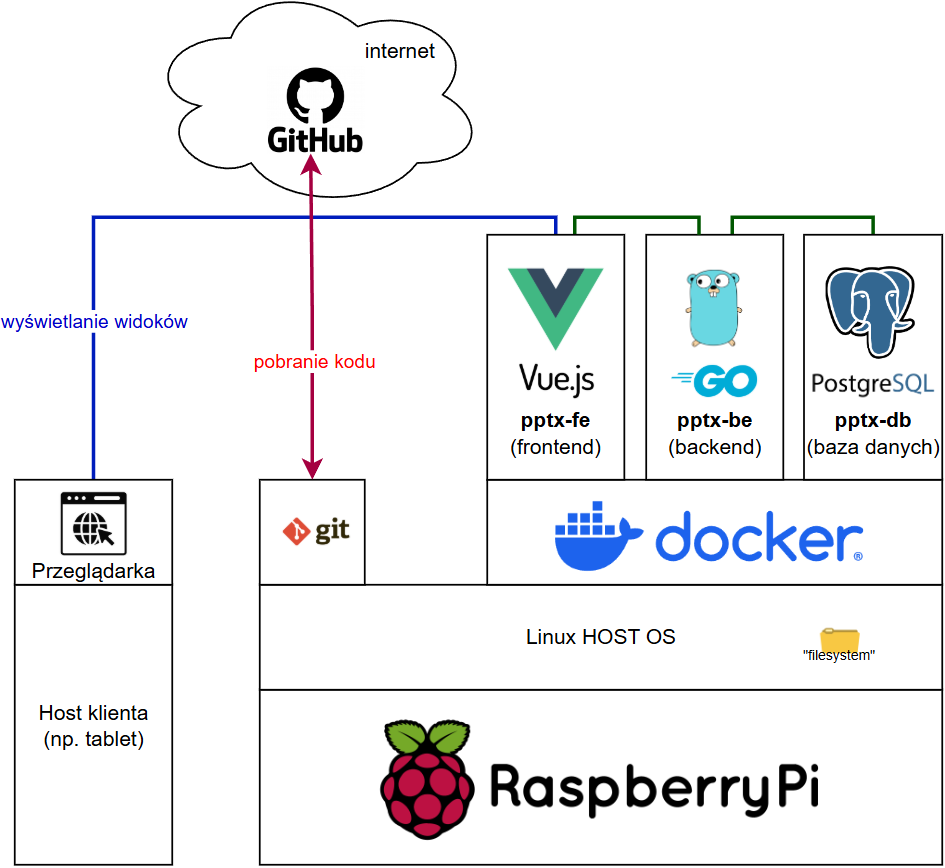
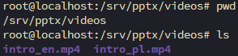

# PPTX-QUIZ
## Widoki

| Widok | Ścieżka  | Opis                                                         |
| ----- | -------- | ------------------------------------------------------------ |
| Hello | `/hello` | Ekran powitalny quizu/testu                                  |
| Admin | `/plik`  | Panel admina. Zarządzanie plikiem z pytaniami oraz podgląd wyników. |
| Video | `/video` | Ekran do wyświetlenia filmu ze szkolenia wstępnego.          |

## Architektura



## Pliki z video

Pliki z video muszą znajdować się w "filesystem" **Linux HOST OS** w folderze `/srv/pptx/videos`. z nazwami `intro_pl.mp4` i `intro_en.mp4` o tak:



## Uruchomienie

### Prerequisities

- [docker](https://docs.docker.com/engine/install/)
- [make](https://askubuntu.com/questions/161104/how-do-i-install-make)

### 1 Pobranie kodu z git

```sh
git clone <link_do_repozytorium>
cd pptx-quiz
```

#### Zaciągnięcie najnowszych zmian kodu
```sh
git pull
```

### 2 Zbudowanie obrazów Docker

> Docker image - to odpowiednik obrazu maszyny wirtualnej. 

#### Debugowanie obrazów
Podgląd dostępnych obrazów:
```sh
docker images
```
Usunięcie obrazu:
```sh
docker rmi <nazwa_obrazu>
```

#### Zbudowanie obrazów be i fe z kodu
##### backend (go)
```sh
cd be
make docker-build
```
##### frontend (vue.js)
```sh
cd fe
make docker-build
```

### 3 Uruchomienie kontenerów Docker
> Kontenery należy uruchamiać w kolejności: baza → backend → frontend
##### baza danych (postgreSQL)
```sh
cd be
chmod +x run_db.sh
./run_db.sh
```
##### backend (go)
```sh
cd be
make docker-run
```
##### frontend (vue.js)
```sh
cd fe
make docker-run
```

#### Debugowanie kontenerów
Wylistowanie działających kontenerów
```sh
docker ps
```

Wylistowanie wszystkich kontenerów (łącznie z martwymi/zatrzymanymi)
```sh
docker ps -a
```

Wyświetlenie logów z danego kontenera
```sh
docker logs <nazwa_kontenera>
```
